Събота, скучно ми е, правя гуакамоле, реших да поснимам малко процеса. Моето гуакамоле си е по някаква моя измислена рецепта, така че да ми харесва на мен, да си знаете.

Малко известен факт е, че гуакамолето всъщност е кръстено на южно американското племе Гуакамоле.

След като ви обогатих културно, време е да започваме. Вкъщи не ядем много люто, за това ще пропуснем лютите чушки и ще сложим само малко червен лук.

[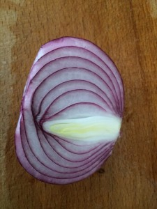](http://hgeorgiev.com/blog/wp-content/uploads/2016/01/IMG_1393.jpg) [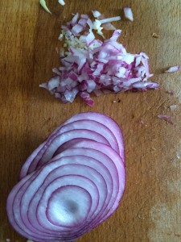](http://hgeorgiev.com/blog/wp-content/uploads/2016/01/IMG_1395.jpg)

И 1-2 скилидки чесънче няма да му дойдат зле.

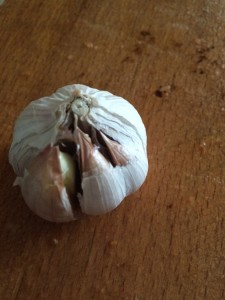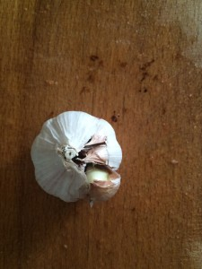

За да не сме хептен без чушки, аз слагам и една печена чушчица :)

 

 

[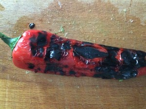](http://hgeorgiev.com/blog/wp-content/uploads/2016/01/IMG_1405.jpg) 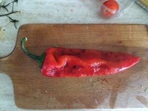

Печена чушка massacre :)

 

[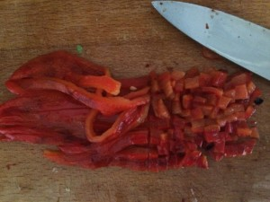](http://hgeorgiev.com/blog/wp-content/uploads/2016/01/IMG_1409.jpg)

Малко доматки...

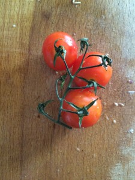

Кълцам авокадото на едно и после мачкам.

[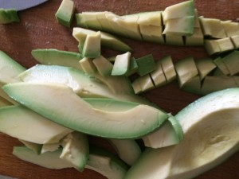](http://hgeorgiev.com/blog/wp-content/uploads/2016/01/IMG_1403.jpg)

 

Малко сол и зехтин и ето как изглежда преди да го разбъркам добре.

[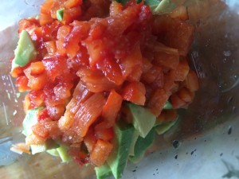](http://hgeorgiev.com/blog/wp-content/uploads/2016/01/IMG_1413.jpg)

 

 

 

 

по принцип хората го мачкат с вилица, аз понеже съм мързелив слагам на миксера само едната бъркалка и бъркам докато започне да ми изглежда добре.

Ето нещо такова е крайния вариант.

[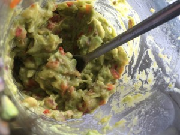](http://hgeorgiev.com/blog/wp-content/uploads/2016/01/IMG_1416.jpg)

По-вкусно е отколкото изглежда, така че не се притеснявайте.

Става бързо и лесно.

чушка 1бр, авокадо 2бр. половин глава лук, 1-2 скилидки чесън, 1-2 чери домата, сол и зехтин на вкус, нещо такова трябва да е .

Между другото онзи интересен факт за произхода на името гуакамоле не е верен, или поне не знаем да има такова племе, но пък звучеше интересно, нали ;)
