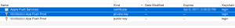
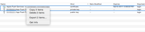

За да пращате push notifications през APNs можете да използвате библиотека от типа на [ZendService\\AppleApns](http://framework.zend.com/manual/current/en/modules/zendservice.apple.apns.html)

Документацията им е обяснява как се ползва библиотеката, но не и как да си генерираме необходимия сертификат. Процедура, която може да се окаже малко по-сложна от колкото изглежда.

Като за начало, влизаме в developer.apple.com и в секцията Identifiers, кликаме на App ID. Ако нямате създадено App ID за вашето приложение си правите и после кликате на името му в списъка, след това избирате бутона Edit.

Сколвате надолу докато не намерите Push Notifications. От там избирате Create Certificate. Следвате инструкциите на екрана, отваряте Keychain-a и т.н.

Както казва най-добрия iOS dev на юг от стара планина - Милен, тук най-важното е в полето Common Name да напишете нещо, което има някакъв смисъл, примерно MyAppName Push Production или нещо от този тип.

След като генерирате сертификата си го изтегляте и import-вате в keychain-a.

В полето за търсете пишете push, трябва да ви излязат 3 резултата - 1 сертификат, един частен и един публичен ключ.

Важния момент е тук - избирате сертификата и частния ключ и кликате export и на двата.

Експортирате с разширение p12. Отваряте един терминал и пишете :

openssl pkcs12 -in apns-dev-cert.p12 -out apns-dev-cert.pem -nodes -clcerts

 

Взимате тоя pem файл и го засилвате към ZendService\\AppleApns (примерно) и всичко би трябвало да работи.
